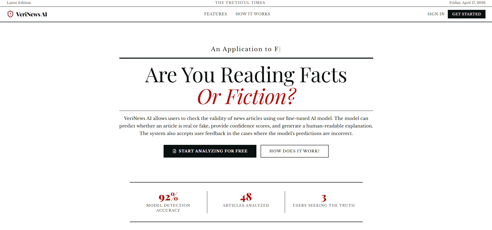

# VeriNews AI - AI-Powered Fake News Detector

Welcome to the VeriNews AI Repo! VeriNews AI is an AI-powered full-stack web application that uses a fine-tuned **RoBERTA** transformer model to analyze news articles and predict whether they are real or fake with **92%** accuracy. Users are able to submit articles and have the model predict the authenticity of these articles with human-readable explanations. Additionally, users can also provide feedback on the models predictions and track their analysis and feedback history. The UI is supposed to evoke an old-school newspaper style.

